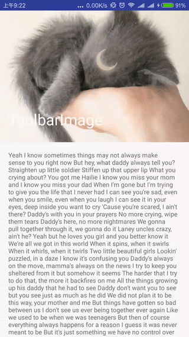

# ToolbarSample
Toolbar with something else like NestedScrollView, Image or TabLayout etc.

## ScreenShot

  

## Note

layout_scrollMode has pin and parallax

layout_scrollFlags is null the toolbar will not scroll

ScrollView can not trigger layout_scrollFlags, you should use NestedScrollView